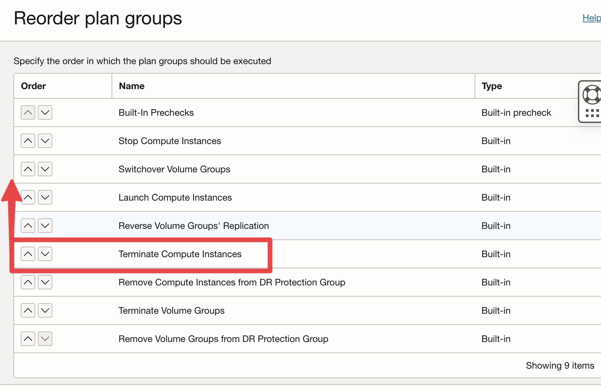
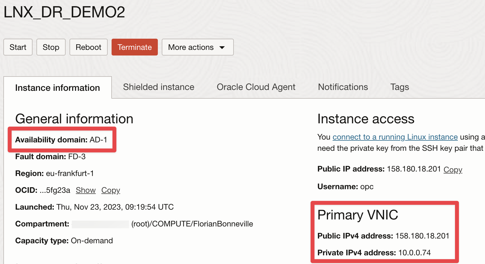

# OCI_DR-WITH-RESERVED-PIP

In this scenario, our objective is to automatically restaure a Compute Instance from one Availability Domain (AD) to another within the same region. 
Specifically, we are transitioning from Frankfurt AD3 to AD1.

While [Full Stack Disaster Recovery](https://docs.oracle.com/en-us/iaas/disaster-recovery/index.html) facilitates the reassignment of the same Private IP, if there is a requirement to also reallocate a Reserved Public IP, utilization of the provided script becomes essential. It is imperative that this script is present locally on each compute instance, irrespective of whether it operates on a Linux or Windows environment.

# Prerequisites

This script will update the Vnic parameters from the Compute Instance, to do so it will authenticate to OCI using [Instance Principals](https://docs.public.oneportal.content.oci.oraclecloud.com/en-us/iaas/Content/Identity/Tasks/callingservicesfrominstances.htm).

You must create the following resources:

##### Create a Dynamic Group

- Create a Dynamic Group called OCI_Scripting and add the OCID of your instance to the group, using :

```
ANY {instance.id = 'OCID_of_your_Compute_Instance'}
```	

##### Create a Policy

- Create a compartment level policy, giving your dynamic group permission to manage all-resources in this compartment:

```
allow dynamic-group OCI_Scripting to manage all-resources in compartment YOUR_COMPARTMENT_NAME
```

##### Download script locally

```
curl https://raw.githubusercontent.com/Olygo/OCI_DR-Reserved_PIP/main/script.py -o /home/opc/script.py
```

##### Grant Admin permissions to the Compute Instance run command plugin. 
The plugin runs as the ocarun user.

From [Invoke custom scripts using the run command with OCI FSDRS](https://docs.oracle.com/en/learn/full-stack-dr-run-command/index.html#introduction) apply :

- "**Task 3. Configure and validate run command in the source VM**"

```
vi ./101-oracle-cloud-agent-run-command
```

**Allow the ocarun user to run all commands as sudo by adding the following line**

```
ocarun ALL=(ALL) NOPASSWD:ALL
```

**Validate if the syntax in the configuration file is correct.**

```
visudo -cf ./101-oracle-cloud-agent-run-command
```

**Add the configuration file to /etc/sudoers.d.**

```
sudo cp ./101-oracle-cloud-agent-run-command /etc/sudoers.d/
```

**Update permisions**

```
sudo chmod 440 /etc/sudoers.d/101-oracle-cloud-agent-run-command
```

**Restart Cloud agent manually**

```
sudo systemctl restart oracle-cloud-agent
```

**Parameters for execution:**

| Argument -| Parameter                             | Description                             |
| --------- | ------------------------------------- | --------------------------------------- |
| -pip      | ocid1.publicip.oc1.eu-frankfurt-1.xxx | add the ocid of your Reserved Public Ip |


# Step by step guide

##### Compute Instance to replicate :
I want to replicate an instance (Linux or Windows) running in Frankfurt Availability Domain #3,


##### Compute Instance volumes :
Instance has 1 block volume attached


##### Compute Instance Reserved PIP :
Instance has 1 Reserved Public IP (pip) assigned


##### Create a Volume Group :
Before creating a Disaster Recovery group you must create a volume group

This volume group will protect volumes in Availability Domain #3

CONSOLE > STORAGE > VOLUME GROUPS > CREATE VOLUME GROUP


##### Volume Group - Volumes :
Add the boot & block volumes of your instance


##### Volume Group - Replication :
Enable the replication to Frankfurt Availability Domain #1


##### Create Primary Disaster Recovery Group : 
Create your Primary DRP Group, without role and members

CONSOLE > MIGRATION & DISASTER RECOVERY > DR PROTECTION GROUPS > CREATE DR PROTECTION GROUP


##### Create Standby Disaster Recovery Group : 
Create your Standby DRP Group, without role and members


##### Compute Instance to replicate :
Add a COMPUTE member to your PRIMARY DRP Group

Select the instance to protect

Select MOVING INSTANCE because we want to reuse the same IPs

Add a VNIC MAPPING in order to specify the Private IP to assign


##### Add a VOLUME GROUP member :
Select the Volume Group created previously


##### Define DRP Groups roles :
Select ASSOCIATE from your PRIMARY DRP group
 


##### Primary and Standby group roles are assigned:


##### Create a SWITCHOVER Plan from the STANDBY DRP group :


##### Reorder Plan Groups  :
Move Terminate Instance BEFORE Launch Instance



##### Reorder Plan Groups  :
Move Terminate Instance BEFORE Launch Instance


##### Add a custom Plan Group:
This task can be added after the last Plan Group


##### Set your custom Plan Group :
SCRIPT PARAMETER :
		
	sudo /usr/bin/python3.6 /home/opc/script.py -pip ocid1.publicip.oc1.eu-frankfurt-1.amaaaaaaXXXXXXXXXXXXXXX


##### Set your custom Plan Group :


##### Set your custom Plan Group :


##### DRP groups are ready to use :


##### Execute DR PLAN from Standby DRP group :


##### Execute DR PLAN from Standby DRP group :


##### DR Plan is running :


##### Compute instance deployment :
Compute instance in AD3 is terminated

Compute instance is created in AD1 using an Ephemeral Public IP


##### DR Plan executes Local custom script from the instance :


##### You can Read/Download your script outputs :


##### Instance restaured in AD1 using the same Public/Private IPs :



##### DRP groups roles have been reversed :


##### Volume Group replication has been enabled from AD1 to AD3 :


## Questions ?
**_olygo.git@gmail.com_**


## Disclaimer
**Please test properly on test resources, before using it on production resources to prevent unwanted outages or unwanted bills.**
